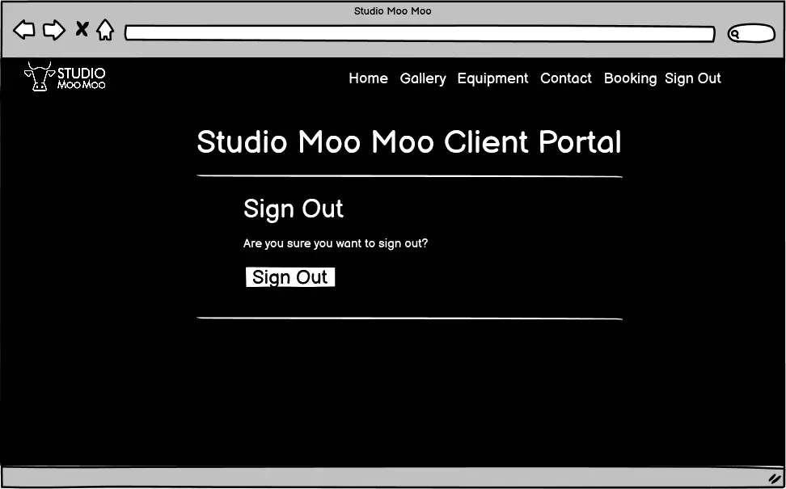
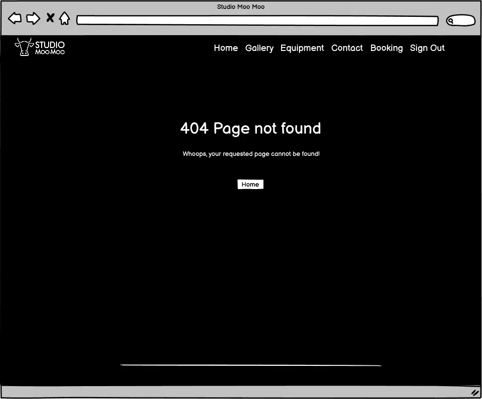
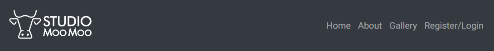
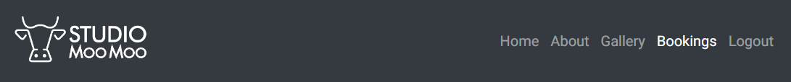
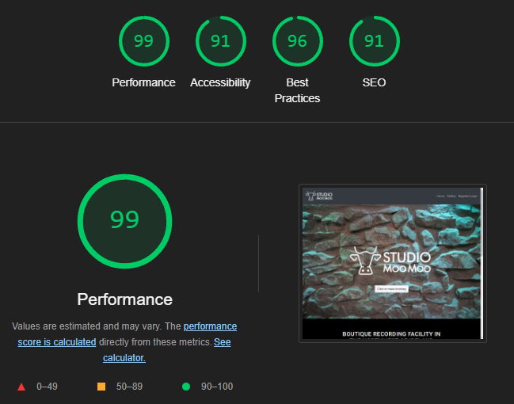

# Studio Moo Moo Client PortaL

## Introduction

This project is to build a front-end client portal for an existing recording studio website (www.studiomoomoo.ie) where you, as a user can book a recording session and access other features.

## Table of Contents
<!--- TO BE GENERATED -->

## User Experience

### User Goals

One of the user goals is to be able to book . They should have a smooth user experience with the 

The main user goal would be to be able to book sessions in the studio. Additionally, the user should have a seamless experience with full CRUD (Create, Read, Update, and Delete) functionality for managing their bookings. Further aims include allowing the user to listen to and download their projects that have been recorded in the studio such as rough mixes and stems and to view details about past bookings.

### Site Owner Goals

The site owner goal is to reduce communication needed when clients need to make bookings and access their data. It also aims to project a professional image and added value to the clients. A serrvice that would not normally be provided by competing studios

### User Stories

Six Epics were decided upon with a total of 39 user stories. All user stories can be viewed here [Projects board](https://github.com/users/astro-mat/projects/2/views/1). Each user story was categorized into one of the following classes: Must have, Should have, Could have, or Won't have. Points were given to each user story based on the estimated time required for completion.

| Class | Points | Percentage of total points |
| -------------- | --------- | --------------- |
| Must have | 46 p | 59 % |
| Should have | 4 p | 5 % |
| Could have | 0 p | 0 % |
| Won't have | 28 p | 36 % |

The following user stories were completed in the first release of Studio Moo Moo Client Portal. To view the Won't have, they are listed here [Projects board](https://github.com/users/astro-mat/projects/2/views/1).

#### Epic 1 - Initial project setup

**User Story - Django installation and configuration**

As a developer, I can install Django and support libraries so that I have the appropriate environment ready to be able to proceed with the development

- Acceptance Criteria 1  
When the project is opened in the browser the web page shows that there has been a successful installation.

**User Story - Hosting setup and configuration**

As a developer, I can create a hosting environment so that I can present the site to the end user

- Acceptance Criteria 1  
When the project app is opened on Heroku, the browser the web page shows that there has been a successful installation. 

#### Epic 2 - User Account Creation

**User Story - Access the registration page**

As a new user, I can easily find the registration page so that I can create an account

- Acceptance Criteria 1  
When I enter the client portal of the website and I am not logged in I should see a register button

- Acceptance Criteria 2  
When I click the Register button I should be brought to a registration form

**User Story - Complete the registration form**

As a new user, I can enter my personal details so that I can register a new account.

- Acceptance Criteria 1  
The  registration form includes fields for necessary information such as email, password etc.
- Acceptance Criteria 2  
The registration form has input validation.
- Acceptance Criteria 3  
Once the user has registered, they recieve confirmation that they have successfully registered.

#### Epic 3 - User Login

**User Story - Account Sign In**

As a registered user, I can sign in with my username/password so that I can access the portal

- Acceptance Criteria 1  
As a registered user when I click log in and enter in the relevant log in criteria i should be logged into the website
- Acceptance Criteria 2  
If I am not a registered user and I try to log in I will see an error message of invalid credentials and will be prompted to register
- Acceptance Criteria 3  
Once the user is logged in, they recieve confirmation that they have.

**User Story - Reset forgotton password**

As a registered user, I can securely obtain Forgotten Password so that I can gain access if password is forgotten

There is a clear option visable to click if you have forgotten your password

- Acceptance Criteria 1  
There is a clear option visable to click if you have forgotten your password
- Acceptance Criteria 2  
Once nessesary information is given by user, there is a clear procedure to follow that results in acess being given 

#### Epic 4 - Studio booking system

**User Story - Creating a new booking**

As a registered user, I can book a slot so that I can secure my place to use the studio.

- Acceptance Criteria 1  
The user can specify when they would like to use the studio.
- Acceptance Criteria 2  
The user can specify equipment requirements.
- Acceptance Criteria 3  
There is confirmation of the booking

**User Story - Viewing My Booking**

As a registered user, I can view my bookings so that i can choose what to do with them

- Acceptance Criteria 1  
The user can see all bookings that they have made
- Acceptance Criteria 2  
The user can modify any future bookings they have made
- Acceptance Criteria 3  
There is confirmation of the modification

**User Story - Cancel A Booking**

As a registered user, I can cancel my book so that I can let the studio know if I cannot make it

- Acceptance Criteria 1  
The user can cancel a booking they have made
- Acceptance Criteria 2  
There is a confirmation of the cancellation

#### Epic 6 - Enhancing Website Asthetics

**User Story - Design is consistent with existing site**

As a user, all areas of site should be consistant in appearance so that I have a great user experience.

- Acceptance Criteria 1  
When navigating between portal and existing website, they should look similar in design

**User Story - Design is responsive**

As a site user, I can easily navigate and view content using wide range of devices so that I have a great user experience

- Acceptance Criteria 1  
The layout automatically adjusts based on screen size and orientation
- Acceptance Criteria 2  
All elements such as text, images, buttons etc are easily viewed and visable on a range of devices
- Acceptance Criteria 3  
All navigation elements are optimised for touch devices

## Design

The design was very much dictated by the original website. It will use predominantly dark but high contrast text. It should draw attention with images that convey the profesional yet comfortable ethos of the studio.

### Color Scheme

The colour scheme is chosen again, to relate to the existing website. It is felt that the main dark elements convey a modern, professional style to prospective clients.

### Typography

The typography was chosen to fit in with the design style establised by the colour choices earlier while still being easy to read. Capitalisation was employed for titles to re-enforce this design choice.

### Imagery

Imagery was important as it signals to prospective clients what they can expect from booking the studio. They needed to highlight the design elements that make up the studios construction, the lighting choices, the equipment available and the general warm and comfortable environment that it claims to be.

### Wireframes

#### Index page

#### Booking Info Page

#### Sign-In Page

#### Sign-Out Page

#### Make Booking Page

#### Edit Booking Page

#### Manage Booking Page

#### Booking Success Page

#### 500 Page

#### 404 Page

### Entity Relationship Diagram - ERD

- Only one custom model was needed to make the website.
- As there would only ever be one artist using the studio each day as a session would be expected to use an entire day, there was no need to specify a time as well as the date.
- Artist name was included as a user may book studio for different projects
- A requirements feild was deemed necessary to allow user to specify any specific needs or requirements for the session such as if a drum kit is need, how many musicians etc.

## Features

### Header

#### Navigation bar

- The navigation bar makes it easy for the user to navigate the site. 
- The user can find the different parts of the home page (and will include more in future versions) and enables the user to login to the portal and log out.
- The navbar is fixed to the top of all pages to allow easy navigation

Once the user is logged in, the navbar changes. "Register/Login" changes to "Logout"

### Index page

#### Hero image

- The hero image is a simple backdrop of the stone walls of the studio outlining the opening theme of the site. Over the top of this is a bold large transparent version of the studio logo in white.
- This section provides the user with a clear visual opening to the site and what to expect
- Below the logo is a call to action button inviting the user to "click to make booking"

#### About Us Section

- Next up is a short section of text giving a brief description of the studio and its origins.

#### Gallery Section

### Booking Info Page

- The site user is brought to a page after clicking the hero image call to action button that details the studio opening hours
- The user is then invited to click another to log in to the Client portal in order to see studio availability and make a booking.

### Sign In Page

The sign-in page allows existing users to log in, enhancing the user experience by eliminating the need to enter their email each time they want to make a booking. It also enables users to view all their bookings in one place.

### Register Page

The Register page includes fields for the user to enter their email, username, password, and password confirmation. This ensures the user registers a contact method and avoids typos in the password.

### Booking Detail Page

- This is the main page that the user is brought to after loging in
- At the top of the page, the user is invited to make a new booking. There is text inputs for Artist name, date of booking and booking requirements.
- The date opens a date box. The user is unable to enter a date that is in the past or is booked by any other artist.
- A button allows the user to make their booking.
- Below this area is a list of bookings already made by this user.
- Within this area, there are buttons to edit or delete each booking

### Booking Successful Page

- After the user has made a booking, they are brought to this page.
- A simple summary of their booking is displayed
- A button allows the user to be directed back to the booking detail page.

### Edit Booking page

- Once a user decides to edit a booking from the booking detail page, they are brought here.
- The current details of the booking are displayed in text boxes. 
- The user can edit any of the booking details.
- The user can then use the buttons to either save the changes or cancel editing.
- They are then brought back to the booking detail page and an alert informs them of their change.

### Booking delete page

- When a user clicks on "Delete" button on booking detail page, they are bought to this page.
- The booking details are displayed and the user is asked if they are sure they want to delete or cancel the deleting process.
- If they decide to delete, they are bought back to the booking detail page with confirmation that the booking was deleted and the table has updated.
- If they change their mind and cancel, tehy are also brought back to the booking detail page with no changes having been made.

### Log Out Page

- Once the user is finished, they can click the Logout button
- They are then taken to the Log out page where they are asked to confirm that they want to log out
- They can then choose to continue and be redirected to the index page.
- Otherwise, they can click "Back to my bookings" or go anywhere using the navbar menu

### Footer

- The footer section includes links to Studio Moo Moo's Facebook, Instagram and twitter pages.
- The design colour and styling reflect those of the header
- The links open to a new tab to allow easy navigation for the user. 
- The footer is valuable to the user as it allows them to find and follow on social media.
- There is also a small piece of stating the copyright restriction

### Password Reset Page

- In the event of a user forgetting their password and being unable to login, on the login page, there is a link labled "forgot password?"
- On clicking this link, they are brought to this page.
- Here they are prompted to enter their email. once submited, an email is sent with instructions on how to change password.

- Once the request to reset has been submitted, the user is taken to this page and they are instructed to follow the instutions on the email when they recieve it.

### Alerts

- When major changes are made by the user, a high contrast alert is visible just below the header

## Features to be Added

Several features can be added in the future.

- Add more content to home page.
- add "contact me" section.
- Date order for bookings on booking detail page.
- Sign in with Social media account or Google credentials.
- Captcha verification when the user is signing up with email address.
- Guidance when a user sign in for the first time.
- Add more functionality to the portal. The proposed media sharing and editing function

## Testing

### Validation of Code

#### HTML

All the pages were tested at the [W3C Markup Validation Service](https://validator.w3.org/). The index page validation is above, all the other validations are linked below.

- [Sign In Page](doc/sign-in-html-valid.PNG)
- [Login Page](doc/register-html-valid.PNG)
- This page showed 4 errors. These seem to originated from AllAuth injected html and as such are not available for me to edit
- [Booking Detail Page](doc/booking-detail-html-valid.PNG)
- [Booking Successful Page](doc/booking-successful-html-valid.PNG)
- [Edit Booking page](doc/edit-booking-html-valid.PNG)
- [Booking delete page](doc/booking-delete-html-valid.PNG)
- [Log Out Page](doc/log-out-html-valid.PNG)
- [Password Reset Page](doc/password-reset-html-valid.PNG)

#### CSS

The CSS code was tested at [W3C CSS Validation Service](https://jigsaw.w3.org/css-validator/). The process completed without errors but generated one warning: "Imported style sheets are not checked in direct input and file upload modes." This warning pertains to fonts imported from Google Fonts.

#### Python

All Python files have been validated using the [CI Python Linter](https://pep8ci.herokuapp.com/) to ensure they meet PEP8 standards. The validation process completed without any errors.

**Booking - views.py**

**Booking - models.py**

**Booking - admin.py**

**Booking - forms.py**

**Booking - urls.py**

**Booking - apps.py**

### Lighthouse

Tests in Lighthouse were performed for both desktop and mobile.

#### Desktop

The test for desktop resulted in scores all over 90.

#### Mobile

The test for mobile resulted in scores all over 90. The performance rating could be further improved by adopting responsive images in order to reduce mobile load time.

### Wave Webaim - accessibility testing

#### Index page

#### Sign In

#### Login page

#### Booking Detail page

#### Booking Successful page

#### Edit Booking page

#### Booking delete page

#### Log Out page

#### Password Reset page

### Contrast Grid

The [Contrast Grid](https://contrast-grid.eightshapes.com/?version=1.1.0&background-colors=&foreground-colors=%23CACACA%2C%20%20Background%20color%0D%0A%23353535%2C%20Text%0D%0A%23411919%2C%20Cancel%20btn%20-%20background%0D%0A%23FFFFFF%2C%20Cancel%2Fconfirm%2Fdelete%20btn%20-%20text%0D%0A%23193A18%2C%20Confirm%20btn%20-%20background%0D%0A%238d3838%2C%20Delete%20btn%20-%20background%0D%0A%23000000%2C%20Footer%20icons&es-color-form__tile-size=compact&es-color-form__show-contrast=aaa&es-color-form__show-contrast=aa&es-color-form__show-contrast=aa18&es-color-form__show-contrast=dnp) resulted in only AAA results for the combination used on the webpage. The main combination throughout the page is #CACACA and #353535 which has a value of 7.4 (where the limit for AAA is 7+).

### Manual Testing

Every page at the website has been manually tested. It is done in Google Chrome DevTools and on different devices. The devices used were one mobile phone, one laptop and one external screen:

- Samsung Galaxy A52s (1080 x 2400)
- HP 250 G4 Notebook PC (1366 x 768)
- HP 2309v LCD Screen (1920 x 1080)

#### Navigation bar

| Feature being tested | Expected Outcome | Testing Performed | Actual Outcome | Result (Pass or fail) |
| -------------------- | ---------------- | ----------------- | -------------- | --------------------- |
| Home link | When clicked, directs the user to the home page | Click at "Home" | Got directed to the home page | Pass |
| Logo link | When clicked, directs the user to the home page | Click at "Logo" | Got directed to the home page | Pass |
| About link | When clicked, directs the user to the about section of the Home page | Click at "About" | Got directed to the about section of the Home page | Pass |
| Gallery link | When clicked, directs the user to the Gallery section of the home page | Click at "Gallery" | Got directed to the Gallery section of the home page | Pass |
| Register/Log in link | When clicked, directs the user to the Log in page | Click at "Register/Log in" | Got directed to the Log in page | Pass |
| Bookings link not visible (signed out) | Bookings link not visible as a signed out user | Sign out and inspect navigation bar | Bookings link not visible | Pass |
| Bookings link visible (signed in user) | Bookings link visible as a signed in user | Sign in, check navigation bar | Bookings link visible | Pass |
| Bookings link | When clicked, directs the signed in user to the Bookings page | Sign in, click at "Bookings" | Got directed to the Bookings page | Pass |
| Log Out link not visible (signed out) | Log Out link not visible as a signed out user | Log Out and inspect navigation bar | Log Out link not visible | Pass |
| Log Out link visible (signed in user) | When clicked, directs the user to the Log Out page | Click at "Log Out" | Got directed to the Log Out page | Pass |
| Log Out link | When clicked, directs the signed in user to the Log Out page | Sign in as a staff or superuser, click at "Log Out" | Got directed to the Log Out page | Pass |

#### Index page

| Feature being tested | Expected Outcome | Testing Performed | Actual Outcome | Result (Pass or fail) |
| -------------------- | ---------------- | ----------------- | -------------- | --------------------- |
| Responsive design | The page changes so the content fit at the smallest to the largest screens without scrolling sideways | In DevTools, select the smallest device and make it larger step by step | The index page was responsive and changed depending on screen size | Pass |
| "Click to make booking" button | Directs the user to the Register/Login page | Click at the "Click to make booking" button | Got directed to the Register/Login page | Pass |
| Text readability | Enough margins and padding to make text readable | Read all text blocks at all different Bootstrap breakpoints | The text is readable at all breakpoints | Pass |

#### Log In Page

| Feature being tested | Expected Outcome | Testing Performed | Actual Outcome | Result (Pass or fail) |
| -------------------- | ---------------- | ----------------- | -------------- | --------------------- |
| Responsive design | The page changes so the content fit at the smallest to the largest screens without scrolling sideways | In DevTools, select the smallest device and make it larger step by step | The page was responsive and changed depending on screen size | Pass |
| Text readability | Enough margins and padding to make text readable | Read all text blocks at all different Bootstrap breakpoints | The text is readable at all breakpoints | Pass |
| All fields required | An error message appears when the user tries to sign in but leaves one field empty | Leave one field empty one by one and try to Sign In | An error message appeared when a field was left empty | Pass |
| Remember me button | when selected when loging in, user details are remembered at next login | select when loging in, log out and return | User details were remembered on returning to the page | Pass |
| Sign In button | When the "Sign In" button is pressed, the user gets signed in | Click at "Sign In" button | The user gets signed in | Pass |
| Redirected | When the "Sign In" button is pressed, the user gets redirected to the booking detail page | Visit Register page, click Sign in, press "Sign In" button | The user got redirected to Booking Detail page | Pass |
| Sign Up button | When the "Sign Up" button is pressed, the user redirected to Register page | Click at "Sign Up" button | The user gets redirected to Register/Login page | Pass |
| Forgotten Password Link | When link is clicked, user is redirected to password reset page | Visit Log In page, click on "Forgot password" Link | When link is clicked, user is redirected to password reset page | Pass

### Register page

| Feature being tested | Expected Outcome | Testing Performed | Actual Outcome | Result (Pass or fail) |
| -------------------- | ---------------- | ----------------- | -------------- | --------------------- |
| Responsive design | The page changes so the content fit at the smallest to the largest screens without scrolling sideways | In DevTools, select the smallest device and make it larger step by step | The page was responsive and changed depending on screen size | Pass |
| Text readability | Enough margins and padding to make text readable | Read all text blocks at all different Bootstrap breakpoints | The text is readable at all breakpoints | Pass |
| All fields required | An error message appears when the user tries to sign up but leaves one field empty | Leave one field empty one by one and try to Sign Up | An error message appeared when a field was left empty | Pass |
| Redirected | When the "Sign Up" button is pressed, the user gets redirected to the Booking Detail Page  | Visit Register page, fill out all required fields, press "Sign Up" button | The user got redirected to Booking Detail page | Pass |

#### Booking Detail page

| Feature being tested | Expected Outcome | Testing Performed | Actual Outcome | Result (Pass or fail) |
| -------------------- | ---------------- | ----------------- | -------------- | --------------------- |
| Responsive design | The page changes so the content fit at the smallest to the largest screens without scrolling sideways | In DevTools, select the smallest device and make it larger step by step | The page was responsive and changed depending on screen size | Pass |
| Text readability | Enough margins and padding to make text readable | Read all text blocks at all different Bootstrap breakpoints | The text is readable at all breakpoints | Pass |
| All fields required | An error message appears when the user tries to make a booking but leaves one field empty | Leave one field empty one by one and try to Make a booking | An error message appeared when a field was left empty | Pass |
| Redirected after "Make A Booking" | When the "Make a booking" button is pressed, the user gets redirected to the Booking Success Page  | Visit Booking Detail page, fill out all required fields, press "Make a booking" button | The user got redirected to Booking Success page | Pass |
Edit Booking Redirect| When the "Edit" button is pressed, User is redirected to Edit Booking page | Visit Booking Detail Page, Select a booking to edit, Click "Edit" | The user got redirected to Edit Booking page for that booking | Pass |
Delete Booking |  When the "Delete" button is pressed, User is redirected to Edit Delete Booking page | Visit Booking Detail Page, Select a booking to delete, Click "Delete" | The user got redirected to Delete Booking page for that booking | Pass |
Date Validation | If the user attempts to make a booking on a date that there is already a booking booked, An error message appears and user is unable to proceed with that date | Visit Booking Detail Page, Fill in all fields, Select a date that is already booked, Click "Make A Booking" |  An error message appears when the user tries to click "Make A Booking if that date is unavailable | Pass

#### Booking Successful page

| Feature being tested | Expected Outcome | Testing Performed | Actual Outcome | Result (Pass or fail) |
| -------------------- | ---------------- | ----------------- | -------------- | --------------------- |
| Responsive design | The page changes so the content fit at the smallest to the largest screens without scrolling sideways | In DevTools, select the smallest device and make it larger step by step | The page was responsive and changed depending on screen size | Pass |
| Text readability | Enough margins and padding to make text readable | Read all text blocks at all different Bootstrap breakpoints | The text is readable at all breakpoints | Pass |
| Correct Information displayed | The page should display the details of the booking that the user just made | Visit "Booking Detail" page, click "Make A booking" | Booking Successfull Page displays the infomation of the booking just made | Pass
| "Back to bookings" Button | When the "Back to Bookings" button is pressed, the user gets redirected to "Booking Detail" page | Click at "Back to bookings" button | The user gets redirected to "Booking Detail" page | Pass |

#### Edit Booking page

| Feature being tested | Expected Outcome | Testing Performed | Actual Outcome | Result (Pass or fail) |
| -------------------- | ---------------- | ----------------- | -------------- | --------------------- |
| Responsive design | The page changes so the content fit at the smallest to the largest screens without scrolling sideways | In DevTools, select the smallest device and make it larger step by step | The page was responsive and changed depending on screen size | Pass |
| Text readability | Enough margins and padding to make text readable | Read all text blocks at all different Bootstrap breakpoints | The text is readable at all breakpoints | Pass |
| Correct Information displayed | The page should display the details of the booking that the user just made | Visit "Booking Detail" page, click "Edit" |  Edit Booking Page displays the infomation of the booking to be edited | Pass
| Edit Booking | Any field can be edited | Visit Booking detail Page, select a booking to edit, click "Edit booking", Make changes to every field | All Fields are able to be edited | Pass
| "Save Booking" Button | After making a change, Clicking on "Save booking" button redirects user to Booking detail page and changes are displayed | Visit Edit Booking page, make a change to booking, click "Save Booking" | User is redirected to Booking detail page and changes are displayed | Pass

#### Booking delete page

| Feature being tested | Expected Outcome | Testing Performed | Actual Outcome | Result (Pass or fail) |
| -------------------- | ---------------- | ----------------- | -------------- | --------------------- |
| Responsive design | The page changes so the content fit at the smallest to the largest screens without scrolling sideways | In DevTools, select the smallest device and make it larger step by step | The page was responsive and changed depending on screen size | Pass |
| Text readability | Enough margins and padding to make text readable | Read all text blocks at all different Bootstrap breakpoints | The text is readable at all breakpoints | Pass |
| Correct Information displayed | The page should display the details of the booking that the user wants to delete | Visit "Booking Detail" page, click "Delete" |  Delete Booking Page displays the infomation of the booking to be Deleted | Pass
| "Delete Booking" Button | User is redirected back to Booking detail page, desired booking has been deleted | From delete booking page, click "Delete" | User is redirected back to Booking Detail page and the booking has been deleted | Pass 
| "Cancel" Button | User is redirected back to Booking detail page, desired booking has not been deleted | From delete booking page, click "Cancel" | User is redirected back to Booking Detail page and the booking has not been deleted | Pass 

#### Log Out page

| Feature being tested | Expected Outcome | Testing Performed | Actual Outcome | Result (Pass or fail) |
| -------------------- | ---------------- | ----------------- | -------------- | --------------------- |
| Responsive design | The page changes so the content fit at the smallest to the largest screens without scrolling sideways | In DevTools, select the smallest device and make it larger step by step | The page was responsive and changed depending on screen size | Pass |
| Text readability | Enough margins and padding to make text readable | Read all text blocks at all different Bootstrap breakpoints | The text is readable at all breakpoints | Pass |
| "Sign Out" Button | User is redirected to index page, Navbar menu has changed, user no longer has access to Bookings detail page | From Log out page, click "Sign out" button | User is redirected to index page, Navbar menu has changed, user no longer has access to Bookings detail page | Pass 
| "Back to my Bookings" | User is redirected back to Booking Detail page, Navbar menu has not changed, user still has access to Bookings detail page | From Log out page, click "Back to my Bookings" button | User is redirected to Booking Detail page, Navbar menu has not changed, user still has access to Bookings detail page | Pass 

#### Password Reset page

| Feature being tested | Expected Outcome | Testing Performed | Actual Outcome | Result (Pass or fail) |
| -------------------- | ---------------- | ----------------- | -------------- | --------------------- |
| Responsive design | The page changes so the content fit at the smallest to the largest screens without scrolling sideways | In DevTools, select the smallest device and make it larger step by step | The page was responsive and changed depending on screen size | Pass |
| Text readability | Enough margins and padding to make text readable | Read all text blocks at all different Bootstrap breakpoints | The text is readable at all breakpoints | Pass |
| All fields required | An error message appears when the user tries to reset password with field empty | Leave password field empty try to reset password | An error message appeared when a field was left empty | Pass |
| "Rest my Password" Button | 

#### Password reset done page

| Feature being tested | Expected Outcome | Testing Performed | Actual Outcome | Result (Pass or fail) |
| -------------------- | ---------------- | ----------------- | -------------- | --------------------- |
| Responsive design | The page changes so the content fit at the smallest to the largest screens without scrolling sideways | In DevTools, select the smallest device and make it larger step by step | The page was responsive and changed depending on screen size | Pass |
| Text readability | Enough margins and padding to make text readable | Read all text blocks at all different Bootstrap breakpoints | The text is readable at all breakpoints | Pass |
| Reset Email is sent and recieved | User recieves an email with further instructions | Click on "Forgot Password" link from Log in page, enter email, click reset password, check if email is recieved | Email is recieved with instructions to reset | Pass

  

